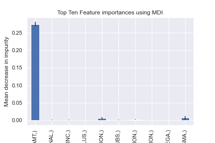

# Neural_Network_Charity_Analysis

## Overview

The objective of this analysis is to use Neural Networks to determine where is best for Alphabet Soup, a charity organization, to make investments. The ultimate goal of this analysis is to make a binary classifier that is capable of predicting whether an applicant will be succesful if funded by Alphabet Soup. With a dataset of over 34,000 applicants and using 12 columns of data to sort through, the objective of the challenge and it's overall scope is truly complicated. Fortunately, we are up for the challenge.

## Results

First and foremost we need to break down the data using a process known as Data Preprocessing. This is a series of reviewing the data, making changes to the data and going back and reviewing again. With a data set this large, it can be very time consuming but we will be reviewing the process one step at a time.

## Deliverable 1: Preprocess

First step is to read in the data and review the initial data. Once the data was imported in as a DataFrame it looked like this:

As you can see there are 12 columns. However some may be a distraction for our machine learning model. So we start by dropping these columns from the table. For our first machine learning pass we drop EIN and the NAME columns. Next we determine columns with more than 10 unique values and create a cut off point for them to bin a portion of those unique values together. Next we use a feature called One-Hot Encoding to transform the categorical data to numerical data and merge the new data with the old. Lastly, we split the data into training and testing datasets for Machine Learning.

The Code:
[CodeD1](./AlphabetSoupCharity_D1.ipynb)

## Deliverable 2: Build the Machine Learning Model

At this point we are ready to compile, train and evaluate our first model. Let's not waste any time and review our findings.

### First Machine Learning Attempt:

The Model:

The accuracy results were .69 which is good, but it could be better. Let's move on to the next attempt.

The Code:

[CodeD2](./AlphabetSoupCharity_D2.ipynb)

## Deliverable 3: Optimize the Model

### Optimization 1:

At this stage we are looking to improve our accuracy score by making adjustments to the first machine learning attempt and trying again. First we tweak the Preprocessing aspect. Like the first run we drop EIN and NAME, but we also drop low information columns like STATUS and SPECIAL_CONSIDERATIONS. We also once again bin APPLICATION TYPE and CLASSIFICATION. Another approach to improving the accuracy of a Machine learning model is to add additional hidden layers to test the data and to decrease the epochs. With all those things done here are the results.

### Second Machine Learning Attempt:

The Model:

The accuracy results were 0.72 which is an improvement, but let's keep trying. Let's move on to the next attempt.

The Code:

[CodeD3.1](./AlphabetSoupCharity_D3_1.ipynb)

### Optimization 2:

As we continue to try to improve our results we make a few changes to the attempts above. First instead of removing the NAME column we bucket the names into categories and we add an additional hidden layer and change the activation functions to sigmoid

### Third Machine Learning Attempt:

The Model:

The accuracy results were 0.74 which is yet another improvement, but let's keep trying. Let's move on to the next attempt.

The Code:

[CodeD3.2](./AlphabetSoupCharity_D3_2.ipynb)

### Optimization 3:

As we continue to try to improve our results we make a few more changes to the attempts above. First instead of placing all the NAME column in buckets we only bucket the largest portion of categories at this point there is no need to make any additional adjustments to the model.

### Third Machine Learning Attempt:

The Model:

The accuracy results were 0.78 accuracy which is still yet another improvement. So in addition to this we also add a RandomForestClassifier. This allows us to make a comparison to it's tools and adds additional features like a confussion matrix, a precision report and a list of feature importances. The results of the RandomForestClassifier were also about 0.78 accuracy.

Confussion Matrix:

Precision Report:

Top Ten Feature Importances Chart

The Code:

[CodeD3.3](./AlphabetSoupCharity_D3_3.ipynb)

## Summary

Neural Networks are an excellent way to understand data and the their significance in the decission that we make related to the data. These are based on the human mind, but capable of a great deal of indepth predictions. The only model that I feel would help more is to perhaps bucket the names again but use a sigmoidal function. I think the combination would yield an equally accurate result.

